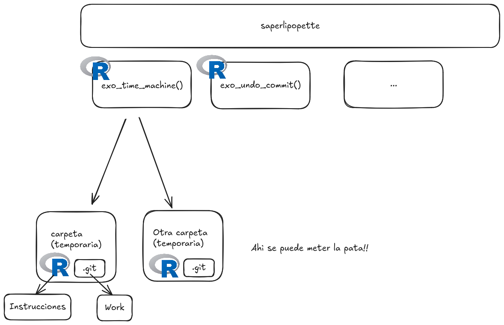

---
format:
  revealjs:  
    highlight-style: a11y
    auto-stretch: true
    hash-type: number
    slide-number: false
    controls: auto
    progress: false
    from: markdown+emoji
    theme: [custom.scss]
    center: false
    include-in-header: noindex.html
    menu:
      width: full
---

## {background-image="rolls.jpg"}

::: r-fit-text
::: {style="font-size:2.0em; padding: 0.0em 0.2em; background-color: rgba(255, 255, 255, .8);"}
¡Miércoles, Git!
:::
:::


::: {.absolute left="5%" bottom="2%"  style="font-size:1em; padding: 0.0em 0.2em; background-color: rgba(255, 255, 255, .8);"}
Maëlle Salmon <https://miercoles-git-mejor.netlify.app/>
:::

::: {.notes}
rolls https://www.pexels.com/photo/toilet-paper-rolls-wrapped-in-different-colors-4031866/
:::

## ¿Qué es Git? {.center}

Git es un Sistema de Control de Versión (VCS).

## ¿Qué es Git? {.center}

> Git se [parece] más a un sistema de archivos miniatura con algunas herramientas tremendamente poderosas desarrolladas sobre él, que a un VCS [(sistema de control de versión)].

[Scott Chacon, Pro Git (traducción en español)](https://git-scm.com/book/es/v2/Inicio---Sobre-el-Control-de-Versiones-Fundamentos-de-Git)

## ¿Por qué Git? {.center}

> Después de confirmar [un commit] en Git es muy difícil perderla, especialmente si envías [esos cambios] a otro repositorio con regularidad.

[Scott Chacon, Pro Git (traducción en español)](https://git-scm.com/book/es/v2/Inicio---Sobre-el-Control-de-Versiones-Fundamentos-de-Git)

## Además {.center}

. . .

:scroll: Historia que usar

. . .

:deciduous_tree: Ramas


## En realidad... {.center}

A veces duele. :scream:

Podéis compartir cosas feas que os pasaron con Git?


## En realidad... {.center}

A veces duele. :scream:

::: {.incremental}

- Push de datos secretos (llave de API por ejemplo)
- Push de datos pesados
- Commits que nos dan vergüenza
- Commits en ramas equivocadas
- ...

:::

## Nuestros objetivos hoy {.center}

::: {.incremental}

:muscle: Prevenir algunos problemas

:muscle: Practicar cómo salir exitosamente de algunas situaciones horribles

:::

## Como vamos a trabajar {.center}

En tu entorno de Git habitual. 

. . .

Podéis escribir lo que es su forma de usar Git? Yo: Positron+terminal a veces.

## RStudio {.center}

Mostrar donde esta Git, la consola de R, la terminal.

## Positron {.center}

Mostrar donde esta Git, la consola de R, la terminal.

## Otra IDE {.center}

Alguién se atreve a compartir?

## Prevención: `usethis::git_sitrep()` {.center}

```r
# hoy solo Git
usethis::git_sitrep(tool = "git", scope = "user")
```

<https://usethis.r-lib.org/reference/git_sitrep.html>


## Prevención: saber donde estás {.center}

. . .

:eyes: Staging area

. . .

:eyes: Rama

. . .

:eyes: Remote (GitHub?) vs local (tu ordenador)

## Como vamos a trabajar {.center}

En carpetas temporarias creadas por saperlipopette.

. . .

Asi no rompemos nuestros proyectos importantes. 

## {saperlipopette} {.center}

. . .

~~Una herramienta para usar Git~~

. . .

Un paquete R para **crear ejercicios en carpetas propias**.

<https://docs.ropensci.org/saperlipopette/>

. . .

```r
install.packages(
  'saperlipopette', 
  repos = c('https://packages.ropensci.org', 'https://cloud.r-project.org')
)
```

## saperlipopette



## saperlipopette: R para crear ejercicios de Git

::: {.incremental}

- R para crear el ejercicio en otra carpeta.

- R en la nueva sesión para leer las instruciones.

- Tus herramientas usuales para solucionar el problema de Git!

:::

## saperlipopette: cómo usar el paquete

::: {.incremental}

- Llama una función desde una sesión R.

- Va a la carpeta creada (se ve en el output). 

- Abre R en esta carpeta, lee las instrucciones.

- Trabaja con tus herramientas para Git o la terminal.

- Cierra la sesion de ejercicio.


:::


## Prevención: escapar de Vim {.center}

Es difícil usar y salir de Vim...

. . .

Entonces mejor no entres!


## Arreglar el editor de Git {.center}

```r
withr::local_language("es")
carpeta <- withr::local_tempdir()
saperlipopette::exo_check_editor(carpeta)
```

## Arreglar el editor de Git {.center}

Tienes 10 minutos para arreglarlo! 

::: {.incremental}

* Sistema operativo: Windows, macOS, Linux.
* Elegir un editor. RStudio? Positron? Code? Otro editor?
* Funciona el editor desde el terminal? Si no, cosa de PATH.
* <https://docs.github.com/es/get-started/git-basics/associating-text-editors-with-git>

:::


## A practicar situaciones horribles! {.center}

Haré demos y después las haréis también. 


## Mi último commit me da vergüenza 1/2 {.center}

```r
withr::local_language("es")
carpeta <- withr::local_tempdir()
saperlipopette::exo_one_small_change(carpeta)
```

## Mi último commit me da vergüenza 2/2 {.center}

```r
withr::local_language("es")
carpeta <- withr::local_tempdir()
saperlipopette::exo_latest_message(carpeta)
```


## Mi último commit me da vergüenza {.center}

15 minutos para resolver estos ejercicios. :smiling_imp:

```r
withr::local_language("es")
carpeta1 <- withr::local_tempdir()
saperlipopette::exo_one_small_change(carpeta1)
carpeta2 <- withr::local_tempdir()
saperlipopette::exo_latest_message(carpeta2)
```

## Descanso (5 minutos) 😮‍💨  {.center}
## Mis cambios eran equivocados 1/2 {.center}

```r
withr::local_language("es")
carpeta <- withr::local_tempdir()
saperlipopette::exo_undo_commit(carpeta)
```
## Mis cambios eran equivocados 2/2 {.center}

```r
withr::local_language("es")
carpeta <- withr::local_tempdir()
saperlipopette::exo_revert_file(carpeta)
```

## Mis cambios eran equivocados {.center}

15 minutos para resolver estos ejercicios. :smiling_imp:

```r
withr::local_language("es")
carpeta1 <- withr::local_tempdir()
saperlipopette::exo_undo_commit(carpeta1)
carpeta2 <- withr::local_tempdir()
saperlipopette::exo_revert_file(carpeta2)
```


## Hice el commit en una rama equivocada 1/2 {.center}

```r
withr::local_language("es")
carpeta <- withr::local_tempdir()
saperlipopette::exo_committed_to_main(carpeta)
```

## Hice el commit en una rama equivocada 2/2 {.center}

```r
withr::local_language("es")
carpeta <- withr::local_tempdir()
saperlipopette::exo_committed_to_wrong(carpeta)
```

## Hice el commit en una rama equivocada {.center}

15 minutos para resolver estos ejercicios. :smiling_imp:

```r
withr::local_language("es")
carpeta1 <- withr::local_tempdir()
saperlipopette::exo_committed_to_main(carpeta1)
carpeta2 <- withr::local_tempdir()
saperlipopette::exo_committed_to_wrong(carpeta2)
```

## Descanso (5 minutos) 😮‍💨  {.center}


## Hice algo horrible con rebase -i u otra barbaridad {.center}

```r
withr::local_language("es")
carpeta <- withr::local_tempdir()
saperlipopette::exo_time_machine(carpeta)
```

. . .

Soluciónalo tu también en 10 minutos.

## Prevención otra vez {.center}

:sparkles: `.gitignore` :sparkles:

## Demo {.center}

:::{.incremental}

- Creo `carpeta-secreta/`.

- La veo en la staging area.

- Añado `carpeta-secreta` a mi `.gitignore`.

- No la veo más en la staging area.

:::

## Vacuna {.center}

`usethis::git_vaccinate()`

<https://usethis.r-lib.org/reference/git_vaccinate.html>

## ¿Y si hicé un push de mi error? {.center}

. . .

:rocket: `git push -f`

. . .

Pero 

:fire: no en ramas compartidas

:fire: no elimina completamente el commit antiguo en GitHub <https://github.com/ropensci-training/saperlipopette/pull/26>

## Conclusión {.center}

¿Cómo sufrir menos con Git?

. . .

Prevenir problemas: saber donde estás, no usar Vim, usar `.gitignore`.

. . .

Aprender a salir de situaciones de miércoles.

## Otras situaciones que no vimos {.center}

- <https://happygitwithr.com/push-rejected>
- conflicts 
- <https://happygitwithr.com/pull-tricky>
- Athanasia Mo Mowinckel's ["Too much git cleaning"](https://drmowinckels.io/blog/2024/git-clean-woes/)

## {background-image="rolls.jpg"}

::: {.absolute left="5%" top="5%"  style="font-size:1.4em; padding: 0.5em 1em; background-color: rgba(255, 255, 255, .8);"}
¡Gracias! :blue_heart:
Gracias a Andrea Gomez Vargas, Ariana Bardauil y Yanina Bellini Saibene.

<https://miercoles-git-mejor.netlify.app/>

<https://docs.ropensci.org/saperlipopette/>
:::

::: {.notes}
toilet paper rolls wrapped in different colors https://www.pexels.com/photo/toilet-paper-rolls-wrapped-in-different-colors-4031866/
:::


## Recursos de Git: en español {.center}

- <https://intro-programacion.netlify.app/08_git-2>


## Git resources: General books {.center}

- Book [Git in Practice](https://www.manning.com/books/git-in-practice) by Mike McQuaid ([reading notes](https://masalmon.eu/2023/11/01/reading-notes-git-in-practice/))

- Book [Pro Git](https://git-scm.com/book/en/v2) by Scott Chacon ([reading notes](https://masalmon.eu/2024/01/19/pro-git-scott-chacon-reading-notes/))

## Git resources: R {.center}

- "What they forgot to teach you about R" [now](https://github.com/rstats-wtf/wtf-version-control-slides) (E. David Aja) and [then](https://github.com/rstudio-conf-2022/wtf-rstats/tree/main/materials) (Jenny Bryan, Shannon Pileggi).

- [Happy Git and GitHub for the useR](https://happygitwithr.com/) by Jenny Bryan, the STAT 545 TAs, Jim Hester. 

## Git resources: others {.center}

- ["Oh shit, Git!" by Katie Sylor-Miller](https://ohshitgit.com/)

- Julia Evans' zines ["Oh shit, Git!"](https://wizardzines.com/zines/oh-shit-git/) and ["How Git works"](https://wizardzines.com/zines/git/)
